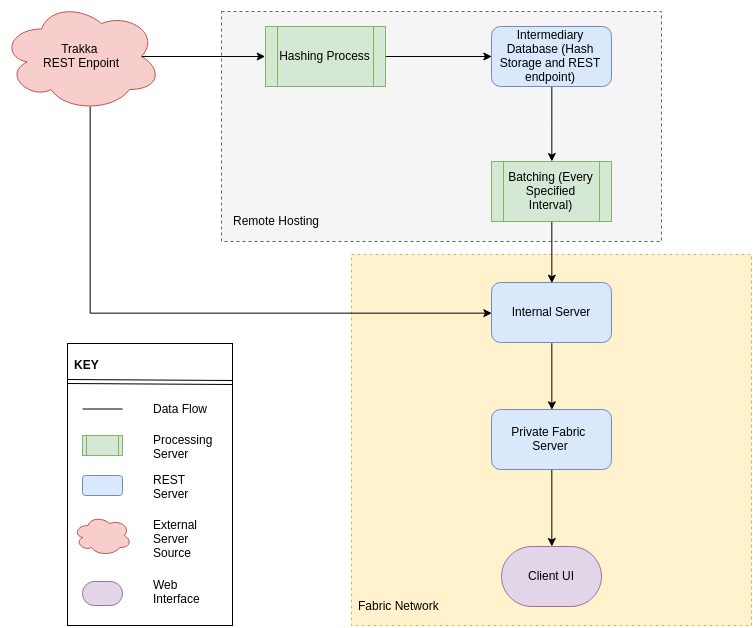

# Capstone Project (Phase II)

This project is intended for Capstone staff to view all source code

The overall system diagram is displayed below:

All parts of the project are self-explanatory by their directory name, although the Internal Server is located in the chaincode/dingo/go/src folder due to having a linkage

Each server is implemented like so below

